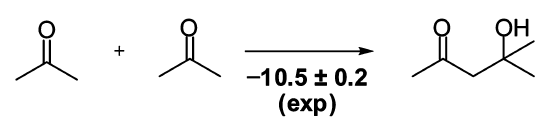

# Density Functional Theory - Comparison with (Post) Hartree-Fock Methods

All methods discussed so far evaluate the energy of a system based on
its wavefunction $\Psi$; a purely mathematical object that lacks any
direct physical interpretation. In the next two sets of exercises, you
will explore a formalism that is based on a physical observable, called
*Density Functional Theory* (DFT). Rather than linking observables to
abstract wavefunctions, DFT relates any observable to a physical,
measurable quantity, the electron density $\rho$ (*cf.* figure 1). In
the next two sets of exercises, you will assess the performance of
various state-of-the-art density functionals in the prediction of
reaction enthalpies and geometric properties, and you will compare your
results to both wavefunction theory and experimental data. The first
exercise constitutes more of a practical introduction; you will be
provided with more ample theoretical information on DFT in the following
week.

## Thermochemical Properties of an Aldol Reaction: Performance of DFT, HF and MP2

The approximation in wavefunction based methods lies in the restriction
and truncation of the expansion of $\Psi$; the Hamiltonian is exact. In
DFT, instead, the approximate quantity is incorporated into the
Hamiltonian. This approximate term is called the *exchange-correlation
functional*, and without further elaborating on methodological details
(we leave this for the oncoming week), you will now explore the
performance of various exchange-correlation functionals of differing
complexity in the prediction of a reaction enthalpy. By doing this, you
will also learn how to create chemical structures in Molden.

### Aldol Reaction of Acetone {#aldol-reaction-of-acetone .unnumbered}

Consider an organic chemistry classic, the Aldol reaction between two
molecules of acetone (*J. Phys. Chem. A*, **2009**, 113, *10376*).

The value for the reaction enthalpy at 0 K, $\Delta H_{0K}$, is found to
be -10.5 kcal mol$^{-1}$ based on experimental data. The reaction
enthalpy at 0 K is simply given by the differences in potential energy
between reactants and products.

### Creating Molecules in Molden 

For larger molecules, the creation of an approximate xyz file that can
be used as the molecular input coordinates is impossible. In these
cases, one may refer to the drawing ability of Molden. First, we may
want to create coordinates for acetone. Run Molden without a file to
read:

    molden

and click on `ZMAT Editor` (it is advisable to do this in the
`Ball & Stick` darwing mode). Then, click on
`Substitute atom by Fragment` and select `CH4`. The screen will now show
a methane molecule, starting from which you may create your target
species. Click on one of the hydrogens, such that it is marked by a red
ball. By selecting `Substitute atom by Fragment` again, you may now
substitute this atom by a `-HC=O` carbonyl group. Click on the new
hydrogen atom of the carbonyl group and substitute it by a methyl group
`-CH3`. The molecule is now completely constructed and the coordinates
are ready to be saved. In the main *Molden Control*, click on `Write`,
select `xyz`, and specify a filename of your choice. The coordinates are
now saved to an xyz file, which is a common format to exchange molecules
between different programs. Do not close Molden at this point.\
You are now ready to create the product structure. As you wish to
calculate the structure as given in the reaction mechanism, you must be
careful not to randomly replace atoms, but to adhere to the desired
geometry (it turns out that the product conformation you are about to
construct is the minimum energy conformation). As we wish the hydroxyl
group of the product to be hydrogen-bonding to the carbonyl group, we
first have to rotate one of the methyl groups so that its hydrogen is in
plane with the carbonyl group. It is easiest to do this by cleverly
choosing a hydrogen atom. It may be more convenient to do the following
for the methyl group you added last. By clicking on one of the
hydrogens, it will be highlighted in the Z-matrix. If you click on the
dihedral angle instead of the element symbol in the Z-matrix editor, you
will see to which atom(s) the current selection is connected, as
illustrated in figure 2.

\
 \

\
Probably, two of the three hydrogens will be specified by a dihedral
with respect to one hydrogen of the same methyl group, the carbon atom
of the methyl group, and the neighbouring carbon. We do not want to
change any of these parameters, as they internally fix the structure of
the methyl group, and we simply want to rotate the methyl group without
changing its internal structure. Find out which of the hydrogen
dihedrals is given with respect to the oxygen of the carbonyl group.
Click on this dihedral, delete the current value of 180$^\circ$, and
replace it by a value of 0$^\circ$. This will cause the methyl group to
rotate. You may now select the same hydrogen again, and substitute it by
an other methyl group. The carbon atom of this methyl group will now be
in plane with the carbonyl group. Again, the methyl group will probably
need to be rotated such that the final hydroxyl group that you will
construct lies in plane as well. Proceed as before: Select the hydrogen
of the methyl group that determines the rotation of the whole group,
*i.e.* the one which has a dihedral that is specified with respect to
the carbonyl C (again, click on the value of the dihedral to see which
atoms are involved). Change this dihedral angle to 0$^\circ$ as well,
such that the desired atoms are now all in plane. Then, you may
substitute the in-plane hydrogen by a hydroxyl group. This hydroxyl
group should be hydrogen bonding to the carbonyl. You will thus have to
change the value of the dihedral that specifies the O-H bond. If you
click on the dihedral, you will see that it is defined in terms of all
the neighbouring carbons. Change the value from 180$^\circ$ to 0$^\circ$
again, and you will end up with the desired chelating structure. In the
end, all that is left to do is to substitute the remaining hydrogen
atoms with one methyl group each. Then, save the coordinates of your
product structure to a new xyz file.

1.  Take a screenshot of your product structure and enclose it in your
    report.

Copy your xyz files to `.com` files with the same name, then open them
in vi. You will see that an xyz file has a very simple structure, namely
a number that specifies the number of atoms, a blank line (which may be
used as a comment line), followed by the coordinates in xyz format.
Delete the first two lines of the `.com` file and provide the additional
information needed for a Gaussian input file based on the existing
coordinates. As a reminder, the format for a Gaussian input file is:

    %NProcShared=2
    %Mem=1GB
    %Chk=CHECKPOINTNAME
    #P METHOD/BASIS_SET Opt

    COMMENT

    CHARGE MULTIPLICITY
    LIST OF XYZ COORDINATES

Of course, there must be a blank line at the end. Because the following
calculations will take some considerable time, we will split the work
among students, each one of you optimising the energy at different
levels of theory.

2.  You have been assigned to one or two level(s) of theory in the table
    below. Create the corresponding Gaussian input files using the
    6-31+G(d,p) basis.

    For MP2 calculations, you should start from a HF geometry and the
    Checkpoint file using `%OldChk=`, indicating `Guess=Read` as well as
    `Geom=Checkpoint` in the route section (cf. exercise of last week).

    Submit your jobs to Gaussian one at a time, then complete the
    following table with the information from your fellow students that
    you can all share on the Moodle webpage. Please try to communicate
    your values one day before the submission to let others copy the
    answers in their reports.

      Method             $E_{reactant}$ \[a.u.\]   $E_{product}$ \[a.u.\]   $\Delta H_{0K}$ \[kcal mol$^{-1}$\]
      ----------------- ------------------------- ------------------------ -------------------------------------
      Exp.                         n/a                      n/a                            -10.5
      *$\Psi$ based*:                                                      
      HF                         Quentin                  Heorhiy          
      MP2                        Quentin                  Heorhiy          
      *$\rho$ based*:                                                      
      BLYP                        Artur                    Sergei          
      mPW1PW91                   Sergei                    Artur           
      B97-2                     Patricia                    Amin           
      PBEPBE                      Amin                    Patricia         
      TPSSTPSS                   Louise                  Alexandre         
      M06-L                     Alexandre                  Louise          
      M06-2X                     Damien                     Jann           

3.  What kind of basis set did you use? On which atoms will polarisation
    and diffuse functions be included?

4.  Comment on the performance of the wavefunction based methods and DFT
    for this reaction. Can you imagine why some DFT methods perform
    better than others? How does DFT compare to MP2 and HF? Would you
    expect the exchange-correlation functionals to give similar errors
    in different systems?

5.  An often cited target for the development of exchange-correlation
    functionals is an error below *chemical accuracy*, *i.e.* within 1
    kcal mol $^{-1}$ of the accurate result. A coupled-cluster based
    scheme called CBS-QB3 predicted $\Delta H_{0K} = -9.2$ kcal
    mol$^{-1}$ for this reaction. In light of this, explain the accuracy
    of the results that you obtained.

6.  Why is it important to construct the starting material and the
    product in a specific conformation, although one is carrying out a
    geometry optimisation for both species?
