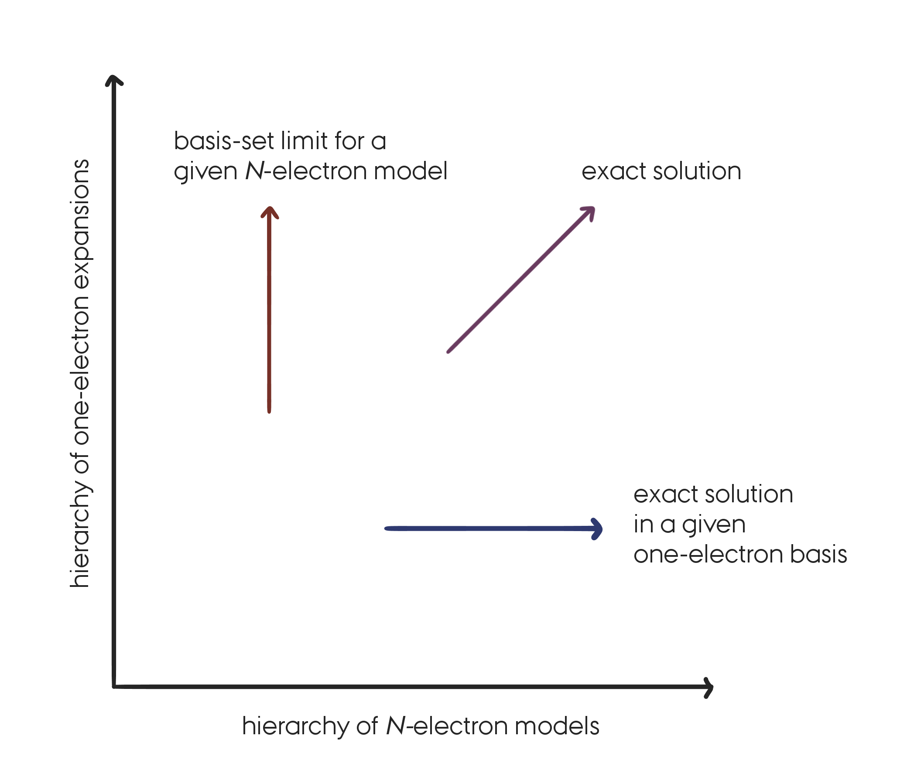

# Coupled cluster

## Recap

We are interested in the (ground-state) solutions of the molecular electronic
Schrödinger equation (i.e. under the Born--Oppenheimer approximation).

So far we have seen:

* **Hartree--Fock (HF):** A mean-field approximation in which the wave-function is
  written as a single Slater determinant. The molecular orbitals (MO) used in the HF
  wave-function are expressed as a linear combination of basis functions (usually atomic orbitals).
  The coefficients of the MO expansion are obtained variationally and are the
  only wave-function parameters.

* **Full Configuration Interaction (FCI):** The exact solution to the
  electronic Schrödinger equation *in a given one-electron basis*. The FCI
  wave-function is expressed as a linear combination of all possible Slater determinant.
  The coefficients of the FCI expansion are obtained variationally and are the
  only wave-function parameters.

* **Truncated CI and Møller--Plesset (MP) theory:** Post HF models providing intermediate 
  results between HF and FCI (compromise between accuracy and computational
  cost). 

* More things that are not really relevant here...

In the wave-function based models described above and in Coupled Cluster (CC)
theory as well, we make approximations of two different kinds:

* In the one-electron space (choice of a *finite* basis set).

* In the N-electron space (choice of a wave-function model).

In this lecture we are only concerned with the approximations introduced in the
N-electron space. We will therefore always consider solutions to the electronic
Schrödinger equation for a particular choice of one-electron basis set, keeping
in mind that for approaching the exact solution it is important to make
improvement in **both** spaces. A FCI solution for a minimal basis set is not
very useful in practice...




The systematic approach to the exact solution of the Schrödinger equation by  successive improvements in the one- and *N*-electron spaces. (Replicated  from Figure 5.1 in [Helgaker2000]_).

## What is Coupled Cluster Theory?


Coupled Cluster Theory corresponds to a set of models that, similarly to
truncated CI and MP theory, have been designed as **post-HF** methods targeting the
FCI solution to the electronic Schrödinger equation. 

The goal of CC is thus to recover the correlation energy, defined as the
difference between the FCI and the HF energy in a given basis set. And to do
that as efficiently as possible, i.e., to recover most of the correlation
energy at the minimum computational cost.

CC theory is often preferred over the CI and MP methods for the two following
reasons: 

* It is **size-extensive** (we will clarify that point in the next section),

* and it provides **fast and systematic convergence** to the FCI solutions.

Perturbation models like MP theory often have convergence troubles, and,
as we will see in the next section, truncated CI methods do not provide
size-extensive energies.

However, these properties of CC theory come at the expense of a variational
formulation. So in standard CC theory, **the CC energy is not variational**.
Another major issue for CC theory is its **high computational cost** and in 
particular the scaling of the cost with the size of the system.

## Size-consistency, size-extensivity, and strict separability


Those three concepts are used to qualify and differentiate quantum chemistry models 
from one another. 
A lot of confusion exists in the literature and it is thus important to explain
what is meant when using those words.

### Size-consistency

The first concept, that we will refer to as *size-consistency*, has to do with 
the ability of a model to properly describe the entire potential energy surface
of a system.  For example at the equilibrium geometry but also when all the
elements are far apart as well as the intermediate regions (bond-breaking
processes). The size-consistency concept (as defined here) is thus more of a 
system dependent problem than a property of an approximate quantum chemistry
model. Of course the FCI solutions are always size-consistent. However, HF
is not always size-consistent (e.g. hydrogen dissociation) and thus all approximate 
post-HF methods will inherit from this issue. When HF is failing, one should 
instead consider multi-configuration and multi-reference methods to provide a 
size-consistent description of the system under consideration.

```{note}
   Unfortunately, the term size-consistent is also often used to describe the
   concept explained below (size-extensivity, and strict separability) which
   are related but fundamentally different.
   This leads to a lot of confusion...
```

### Size-extensivity

This term was introduced in analogy to size-extensive properties in
thermodynamics. A quantum chemistry model (like CC, and FCI) should provide 
size-extensive energies in the sense that the energy should grow linearly with 
the number of electrons in the system. 

### Strict separability

This is the easiest concept to define clearly and the one we are really interested in here.

The idea is that if a system is composed of non-interacting fragments A and B,
such that

```{math}
    H^{AB} | \Psi^{AB} \rangle = E^{AB} | \Psi^{AB} \rangle
```

```{math}
    H^{A} | \Psi^{A} \rangle = E^{A} | \Psi^{A} \rangle, 
    \qquad \text{and} \qquad 
    H^{B} | \Psi^{B} \rangle = E^{B} | \Psi^{B} \rangle,
```

and such that **we can split the Hamiltonian** of the total system as

```{math}
   H^{AB} = H^A + H^B,
```

then, a wave-function model that is *strictly separable* will fulfill the
following conditions on the resulting wave-function and energy.

```{math}
   | \Psi^{AB} \rangle = | \Psi^{A} \rangle | \Psi^{B} \rangle
    \qquad \text{and} \qquad 
   E^{AB} = E^{A} + E^{B}
```

The key here is to understand that when talking about non-interacting system we
mean that the total Hamiltonian can be decomposed into the sum of the
Hamiltonian of the fragments.

```{warning}
   If one is to compute the CC energy of, e.g., a water molecule for a very large
   H--O bond length (e.g. 20 Angstroms), 
   the relation above does not hold unless we specify excplicitly to the computer 
   program that the Hamiltonian should be written as two independent contributions.
   Otherwise, the CC energy of the total system will suffer from the lack of 
   *size-consistency* of the HF solution. CC energies are therefore not always 
   size-consistent (as defined above).

   The size-extensivity and strict separability properties described here are
   mathematical properties and one should be careful when testing those properties
   numerically.
```

### Why do we want size-extensivity?


So why is it important for a good quantum chemistry model to satisfy the strict
separability and the size-extensivity conditions above?

The first and most important reason is that those properties are
properties of the exact solution to the electronic Schrödinger equation. 
For the other reasons, I cannot put it better than that:

> An important advantage of a size-extensive method is that it allows straightforward  comparisons between calculations involving variable numbers of electrons, e.g.  ionization processes or calculations using different numbers of active electrons.   Lack of size-extensivity implies that errors from the exact energy increase as more  electrons enter the calculation. From [Size-Extensivity and Size-Consistency](https://web.archive.org/web/20170606215414/http://www.uam.es/docencia/quimcursos/Docs/Knowledge/Fundamental_Theory/cc/node7.html) (1996) by T. Daniel Crawford. 


One of the main troubles of truncated CI models is that they do not satisfy the
strict separability and size-extensivity properties. On the other hand, truncated
CC methods do satisfy those properties. 
In the appendix :ref:`appendix_h2_dimer` we propose an illustration of the
strict separability problem for a dimer of hydrogen in a minimal basis. 

```{note}
   HF and MP theories also satisfy the strict separability and size-extensivity requirements. 
```

## The Coupled Cluster equations


### The exponential ansatz

The size-extensivity problem of truncated CI methods can be linked to the
linear parametrization of the CI wave-function. 
The CC wave-function, on the other hand relies on a exponential
parametrization, which introduces the non-linearity required to have 
size-extensive energies (see appendix :ref:`appendix_h2_dimer`).
The CC wave-function is usually written as

```{math}
   | CC \rangle = \exp (\hat{T}) | \Phi_0 \rangle
```

where the cluster operator $\hat{T}$ is given by

```{math}
   \hat{T} = 1 + \hat{T}_1 + \hat{T}_2 \dots \hat{T}_N
```

$N$ is the total number of electrons and each cluster operator $\hat{T}_{\mu}$
produces all the determinants that differ in orbital occupation by $\mu$ electrons 
with respect to a reference determinant (e.g. HF). We refer to this process
as (virtual) excitations since it **excites** or promotes $\mu$ electrons from
spin-orbitals that are occupied ($i, j...$) in the reference determinant to virtual (unoccupied)
spin-orbitals ($a, b...$).
For example, the singles and doubles operators acting on a reference
determinant lead to

```{math}
   \hat{T}_1 | \Phi_0 \rangle = \sum_i^{occ} \sum_a^{vir} t_i^a | \Phi_i^a \rangle
```

```{math}
   \hat{T}_2 | \Phi_0 \rangle = \sum_{i<j}^{occ} \sum_{a<b}^{vir} t_{ij}^{ab} | \Phi_{ij}^{ab} \rangle
```

where the $t$ coefficients are usually called the CC amplitudes and are
the equivalent of the expansion coefficients of the CI wave-function, i.e.,
they are the CC wave-function parameters.

```{note}
   The mathematical formalism behind the (virtual) excitation processes is
   called second-quantization. It is at the basis of quantum field theory and
   extensively used in the development of CC theory. For more details on the
   usage of second-quantization in quantum chemistry, see [Helgaker2000]_
```

The CC exponential ansatz can then be expanded explicitly

```{math}
   \exp(\hat{T}) | \Phi_0 \rangle = (1 + \hat{T} + \frac{1}{2!} \hat{T}^2
   + \frac{1}{3!} \hat{T}^3 + \cdots ) | \Phi_0 \rangle.
```

This expansion reveals the non-linearity of the parametrization.
We see for examples that even if the cluster operator is truncated to include
only double excitations, higher excitation will remain in the expansion through
the non-linear terms like $\hat{T}_2 \hat{T}_2$ which correspond to a
quadruple excitation. 

In CC theory, those terms are the key to size-extensivity. They are also
responsible for the fast convergence of CC models to the FCI limit, since 
for an equivalent number of parameters (e.g. between truncated CI and CC) the
CC expansion will include higher excitations indirectly through those
non-linear terms.


### The CC Schrödinger equation


Now that we have seen the expression of the CC wave-function we can insert it into
the electronic Schrödinger equation to determine the CC ground-state energy.

```{math}
   H | CC \rangle = E_{CC} | CC \rangle
```

For reasons that we will not get into here, it is not possible to have an
efficient formulation of CC theory by relying on the variational principle to
minimize the energy. Instead, the CC Schrödinger equation is projected against
the reference state $\Phi_0$. It is also common to work with a similarity
transformed Hamiltonian,

```{math}
   H^{\hat{T}} =  \exp(-\hat{T}) H  \exp(\hat{T})
```

which can be shown to preserve the eigenvalue spectrum of the original
Hamiltonian but it is not a Hermitian operator anymore.
We now have

```{math}
   \exp(-\hat{T}) H  | CC \rangle &= \exp(-\hat{T})  E_{CC} | CC \rangle \\
   \exp(-\hat{T}) H  \exp(\hat{T}) | \Phi_0 \rangle &= E_{CC} \exp(-\hat{T}) \exp(\hat{T}) | \Phi_0 \rangle \\
    H^{\hat{T}} | \Phi_0 \rangle  &= E_{CC} | \Phi_0 \rangle.
```

Projection against the reference determinant leads to the CC energy,

```{math}
   E_{CC} = \langle \Phi_0 | H^{\hat{T}} | \Phi_0 \rangle
```

or more explicitly

```{math}
   E_{CC} = \langle \Phi_0 | \exp(-\hat{T}) H  \exp(\hat{T}) | \Phi_0 \rangle.
```

By expanding the exponentials and using the algebra of the second-quantization 
operators (hidden in the cluster operators), one arrives at the following explicit
expression

```{math}
   E_{CC} = E_{\Phi_0} + \sum_i^{occ} \sum_a^{vir} t_i^a \langle \Phi_0| H | \Phi_i^a \rangle 
   + \sum_{i<j}^{occ} \sum_{a<b}^{vir} (t_{ij}^{ab} + t_i^a t_j^b - t_i^b t_j^a )
     \langle \Phi_0| H | \Phi_{ij}^{ab} \rangle
```

where $E_0$ is the energy corresponding to the reference wave-function
$\Phi_0$. When the reference wave-function is the HF determinant the
expression for the CC energy simplifies to 

```{math}
   E_{CC} = E_{HF}  + \sum_{i<j}^{occ} \sum_{a<b}^{vir} (t_{ij}^{ab} + t_i^a t_j^b - t_i^b t_j^a )
      (ia||jb)
```

due to Brillouin's theorem.

### The CC amplitudes


From the last equation we see that the CC energy if (of course) depending on
the CC wave-function parameters (the amplitudes). As stated previously these
are not obtained variationally but by projection techniques.
To determine the amplitudes we project the CC Schrödinger equation against the
set of excited determinants (up to the truncation level), i.e., for a coupled
cluster with single and double excitations (CCSD) we have to solve the
following non-linear equations

```{math}
   \langle \Phi_i^a | \exp(-\hat{T}) H  \exp(\hat{T}) | \Phi_0 \rangle &= 0, \\
   \langle \Phi_{ij}^{ab} | \exp(-\hat{T}) H  \exp(\hat{T}) | \Phi_0 \rangle &= 0.
```

For higher truncation levels we need to project over excited determinants of
higher excitation ranks.
Note that the right-hand-side of the equation is zero due to orthogonality
between the reference determinant and any excited determinant.

The left-hand-side of the equation can be derived into more explicit
expressions, i.e, in terms of amplitudes and integrals (like the final expression
for the energy) which can be implemented into computer programs.

The CC amplitude equations form a set of non-linear equations which have to be
solved iteratively before the CC energy can be calculated.

```{note}
   The equations presented here correspond to standard CC theory for which the
   reference wave-function must be a single slater determinant. In general this
   determinant is chosen to be the HF wave-function.
```

## CC models and comments


### Standard CC models

With the equations that we have presented in the previous section, the standard
models of CC theory can be easily defined. Basically a given CC model is
defined by the truncation level of the cluster operator  (a bit like in the CI
models). If only single excitations are included, $\hat{T} = \hat{T}_1$,
the CC energy is equal to the HF energy and this model, denoted CCS, is not
relevant here (it can however be used to calculate excited state properties).
The next model is the most common in the standard CC hierarchy. It includes
single and double excitations and it is denoted CCSD. 

As you can imagine, the next steps consist in including
triples, CCSDT, and quadruples, CCSDTQ, etc.
This allows for a systematic convergence to the FCI solution which is the main
selling point of CC theory (together with the size-extensivity property
described before).

### Computational cost

However, as we get closer to the FCI solution, the computational cost of
solving the CC amplitude equations increases drastically. In particular the
scaling of the method with the size of the system, *N*, goes as follows ,

* CCSD already scales as $N^6$,

* CCSDT scales as $N^8$,

* and CCSDTQ as $N^{10}$...


To be more concrete, if it takes 1 minute to perform a CCSD calculation on 1 water molecule, it would take **120 years** to perform the same calculation on a cluster of 20 water molecules.

A lot of work has been done (and is still going on) to lower the computational 
cost of CC models and to develop intermediates in the CC hierarchy.

One particularly popular and successful method is the CCSD(T) model in which,
a standard CCSD calculation is performed and corrected by the effect of triples 
which are included in a perturbative manner (i.e., by relying on arguments from 
many-body perturbation theory).
This method scales as $N^7$ with the system size but recover most of the
effects of a full CCSDT calculation.
Due to the success of the CCSD(T) model, it is often described as the gold-standard
of quantum chemistry.

### What is CC theory used for?

As we have seen CC theory has the following properties:

* **Fast and systematic convergence** to the FCI solutions.

* **Size-extensivity** of the energy, (wave-function and energy strictly separable).

* Fast increase of the computational scaling with the truncation level, i.e.,
  **high computational cost**.

* **Single-reference** method. CC cannot be applied when more than one electronic 
  configuration is important to describe a system, e.g. when breaking bonds. 
  In other words, the (HF) reference needs to provide a qualitatively good 
  description of the system under consideration.

So what can it be used for? 

The ground-state CC theory that has been introduced here can be used to
calculate very accurate ground-state energies of small molecules near their
equilibrium geometry. 

In addition molecular properties (dipole moments, polarizabilities...) and excitation 
energies can be calculated by combining CC theory with response theory (see also the
equation-of-motion EOM-CC methods).

Being able to calculate energies and properties accurately and with a
systematic convergence to the FCI solutions makes it possible to benchmark more
affordable models (like DFT) that can be applied to larger molecules.

It should also be mentioned that since the late 90s, a lot of effort has been put 
in the development of more affordable CC models and a lot of progress has been made.
